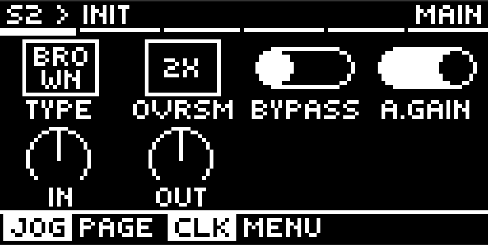
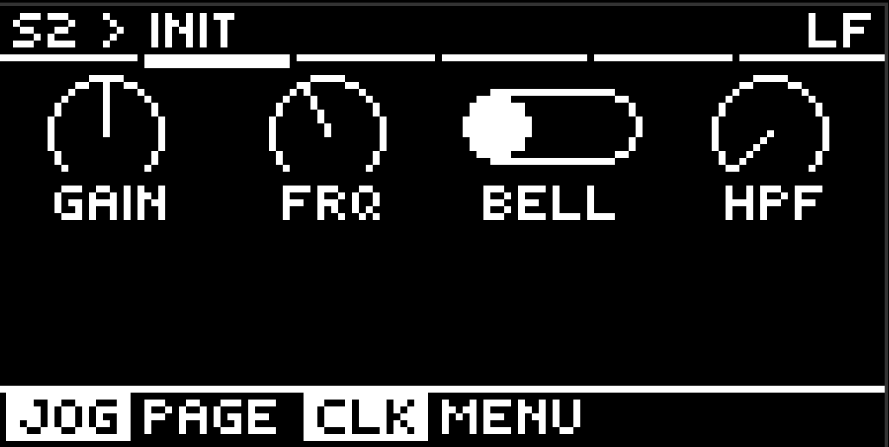
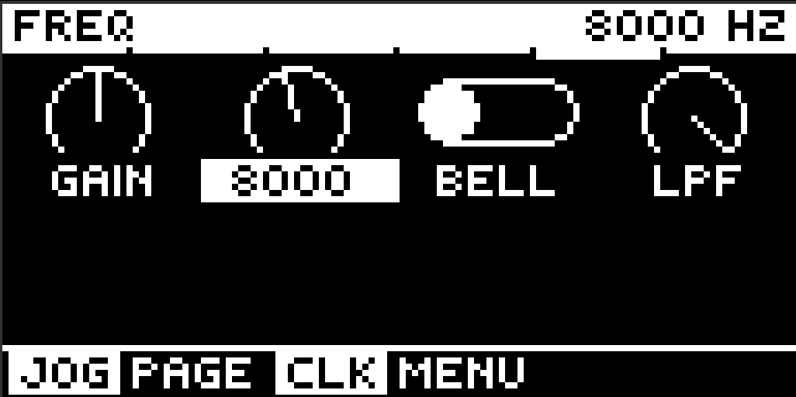
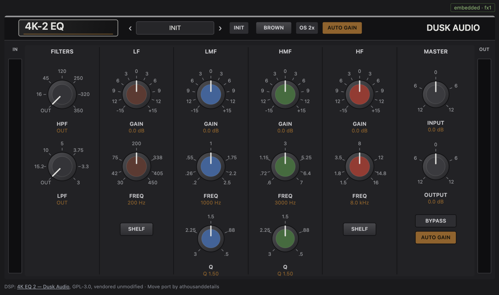

# 4K EQ — British Console EQ for Ableton Move

The EQ and filter section of a classic British console, for
[Schwung](https://github.com/charlesvestal/schwung) on Ableton Move. Four
calibrated bands, stepped high- and low-pass filters, and the Brown and Black
circuit revisions with their own control laws and band interactions. Built for
the master bus.





## Controls

One page per band. The page names the band, so the controls are just what they
are — no hunting.

| Page | 1 | 2 | 3 | 4 | 5 | 6 |
|---|---|---|---|---|---|---|
| **Main** | Type | Ovrsm | Bypass | A.Gain | In | Out |
| **LF** | Gain | Frq | Bell | HPF | | |
| **LMF** | Gain | Frq | Q | | | |
| **HMF** | Gain | Frq | Q | | | |
| **HF** | Gain | Frq | Bell | LPF | | |
| **Preset** | INIT plus fourteen factory programs | | | | | |

Gain is ±15 dB on every band. LF and HF switch between shelf and bell; the two
mid bands are always bell, with Q from 0.5 to 3.

**The filter dials carry their own OUT position**, as the console's do — turn
HPF up off its endpoint and it comes into circuit, turn it back and it leaves.
There is no separate switch. HPF rides on the LF page and LPF on HF, because
that is the end of the spectrum each one works on.

**Type** is the voicing: Brown is the E-series, with transformers and
constant-Q mids; Black is the G-series, transformerless and proportional-Q.
The whole EQ recalibrates, not just the tone.

**Ovrsm** is 1x, 2x or 4x, defaulting to 2x. The response barely moves between
them — under 0.25 dB anywhere — but the console's nonlinearity is always on,
and at 1x it aliases on loud high-frequency material, to about −71 dBc in
Black. 2x puts that below −120 dBc for half a millisecond of latency. Brown at
1x is clean enough for anything.

**A.Gain** trims the output to offset the level your curve adds. It is off by
default because the reference console has no such stage, and it costs you low
end: at +12 dB of HF it pulls 80 Hz down by nearly 8 dB. The Out trim is
usually the better tool.

The Move's FX bus is 16-bit, so a hard boost clips at the output rather than
inside the EQ. The remote panel shows a CLIP badge when it does.

## Remote panel

The console strip in a browser, with the printed dial legends and the real cap
colours. Open it while the module is in an FX slot:

```
move.local:7700/api/remote-ui/module-assets/4k-eq/web_ui.html
```

On a Schwung that offers custom UIs to FX slots
([#253](https://github.com/charlesvestal/schwung/pull/253)) the same panel also
appears inside the module's own section on `move.local:7700/remote-ui`. That
landed on `main` after v0.12.1 was cut, so until the next release the URL above
is the way in. The panel reads the component it is driving from the host, so it
addresses the right FX slot either way.



## CPU

On the Move, per 128-frame block at 44.1 kHz, stereo — 2.0% of one core
sitting flat at 1x, 6.6% at 2x with all four bands and both filters running.
The console nonlinearity is in every one of those numbers; it cannot be
switched off. Bypass is not a saving — the chain still runs and crossfades to
dry.

## Install

**Requires Schwung 0.12.1 or newer.** The device UI is Schwung's own knob
pages — they do not exist before 0.12, and the way this module declares its
graphics landed in 0.12.1. On an older host the EQ loads and passes audio but
has no knobs at all, so check your Schwung version first.

Via the Schwung Module Store, or manually: copy `dist/4k-eq/` to
`/data/UserData/schwung/modules/audio_fx/4k-eq/` on the device.

## Building

Requires Docker (cross-compiles for the Move's ARM64, pinned to glibc 2.35):

```bash
./scripts/build.sh all
./scripts/deploy.sh move.local
```

## Credits

**[4K EQ 2](https://github.com/dusk-audio/dusk-audio-plugins)** by Dusk Audio
(GPL-3.0) — the DSP, vendored unmodified under `src/ported/`; see
`THIRD_PARTY.md`. **Schwung** by Charles Vestal and contributors — the
platform and the stock knob pages.

An independent emulation inspired by classic British console EQs, not
affiliated with or endorsed by any hardware manufacturer.

Built with AI assistance. GPL-3.0; see `LICENSE`.
